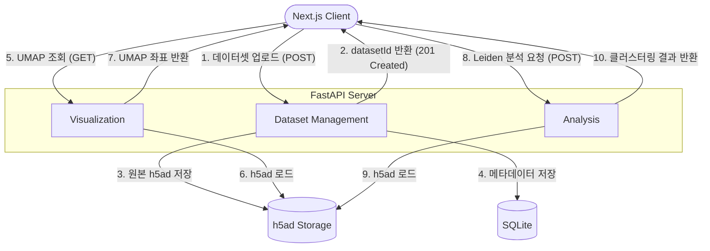

# 아키텍쳐 정리

### 1) Flow Chart

### 2) 시스템 주요 구성 요소

- **Next.js Client:** 사용자가 데이터셋(.h5ad)을 업로드하고 UMAP 시각화 및 클러스터링 결과를 확인하는 프론트엔드입니다.
- **Dataset Management:** 데이터셋 업로드를 담당합니다. 업로드된 파일을 검증한 뒤 원본 파일을 저장하고, 메타데이터를 등록한 후 `datasetId`를 반환합니다.
- **Visualization:** 저장된 데이터셋의 UMAP 좌표를 읽어와 클라이언트가 시각화할 수 있는 형태로 제공합니다.
- **Analysis:** 저장된 데이터셋에 Leiden Clustering을 수행하고 클러스터 라벨 및 분석 결과를 반환합니다.
- **h5ad Storage:** 업로드된 원본 `.h5ad` 파일을 저장하는 파일 시스템입니다.
- **SQLite:** 데이터셋 ID, 파일 경로, 세포 수, 유전자 수, 생성 시간 등의 메타데이터를 저장합니다.

### 3) 전체 처리 파이프라인 (Data Flow)

1. **데이터셋 업로드 (Client → Dataset Management)**
사용자가 `.h5ad` 파일을 업로드하면 서버는 파일 형식과 데이터 구조를 검증합니다.
2. **데이터 저장 (Dataset Management → Storage)**
검증이 완료된 파일은 h5ad Storage에 저장되고, 메타데이터는 SQLite에 저장됩니다. 이후 `datasetId`를 생성하여 클라이언트에 반환합니다.
3. **UMAP 시각화 (Client → Visualization)**
클라이언트가 `datasetId`를 이용해 UMAP 좌표를 요청하면 Visualization 컴포넌트가 저장된 `.h5ad` 파일에서 좌표를 읽어 반환합니다.
4. **Leiden 분석 (Client → Analysis)**
클라이언트가 분석 파라미터(예: `resolution`)와 함께 분석을 요청하면 Analysis 컴포넌트가 저장된 `.h5ad` 파일을 불러와 Leiden Clustering을 수행합니다.
5. **분석 결과 반환 (Analysis → Client)**
생성된 클러스터 라벨과 관련 정보를 클라이언트에 반환하며, 프론트엔드는 이를 이용해 시각화 결과를 갱신합니다.